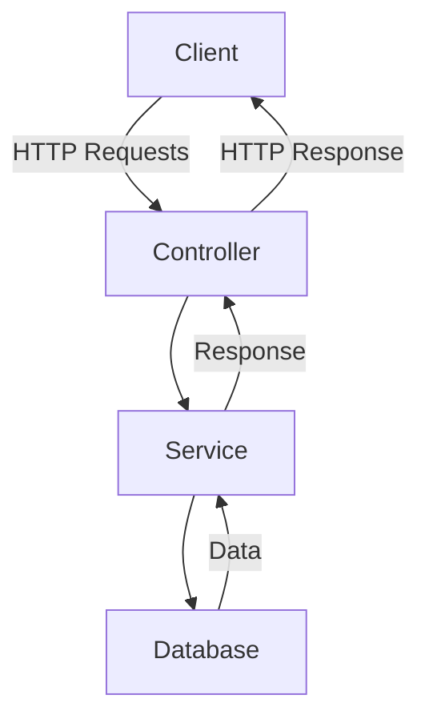
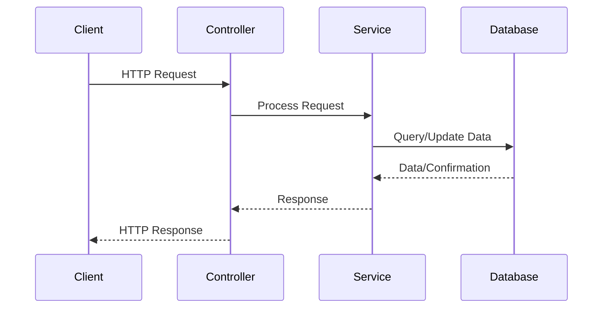

# Sample Node.js Application

This document provides an overview of a sample Node.js application, including its architecture and workflow. The document also includes mermaid diagrams for better visualization.

## Application Overview

The sample Node.js application is a RESTful API that allows users to manage a collection of items. It includes the following features:
- Create, read, update, and delete (CRUD) operations.
- Authentication and authorization.
- Integration with a database (e.g., MongoDB).

## Architecture

The application follows a typical MVC (Model-View-Controller) architecture. Below is a mermaid diagram illustrating the architecture:

## Workflow

The workflow of the application is as follows:
1. The client sends an HTTP request to the server.
2. The controller processes the request and forwards it to the appropriate service.
3. The service interacts with the database to perform the required operation.
4. The service sends the result back to the controller.
5. The controller sends an HTTP response back to the client.

Below is a mermaid sequence diagram illustrating the workflow:

## References

- [Node.js Official Documentation](https://nodejs.org/en/docs/)
- [Express.js Guide](https://expressjs.com/)
- [MongoDB Documentation](https://www.mongodb.com/docs/)
- [Mermaid Documentation](https://mermaid-js.github.io/mermaid/)
